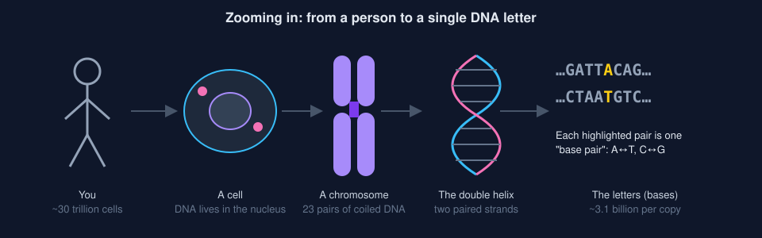
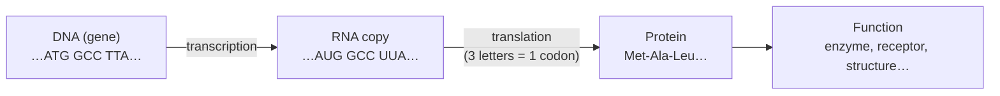
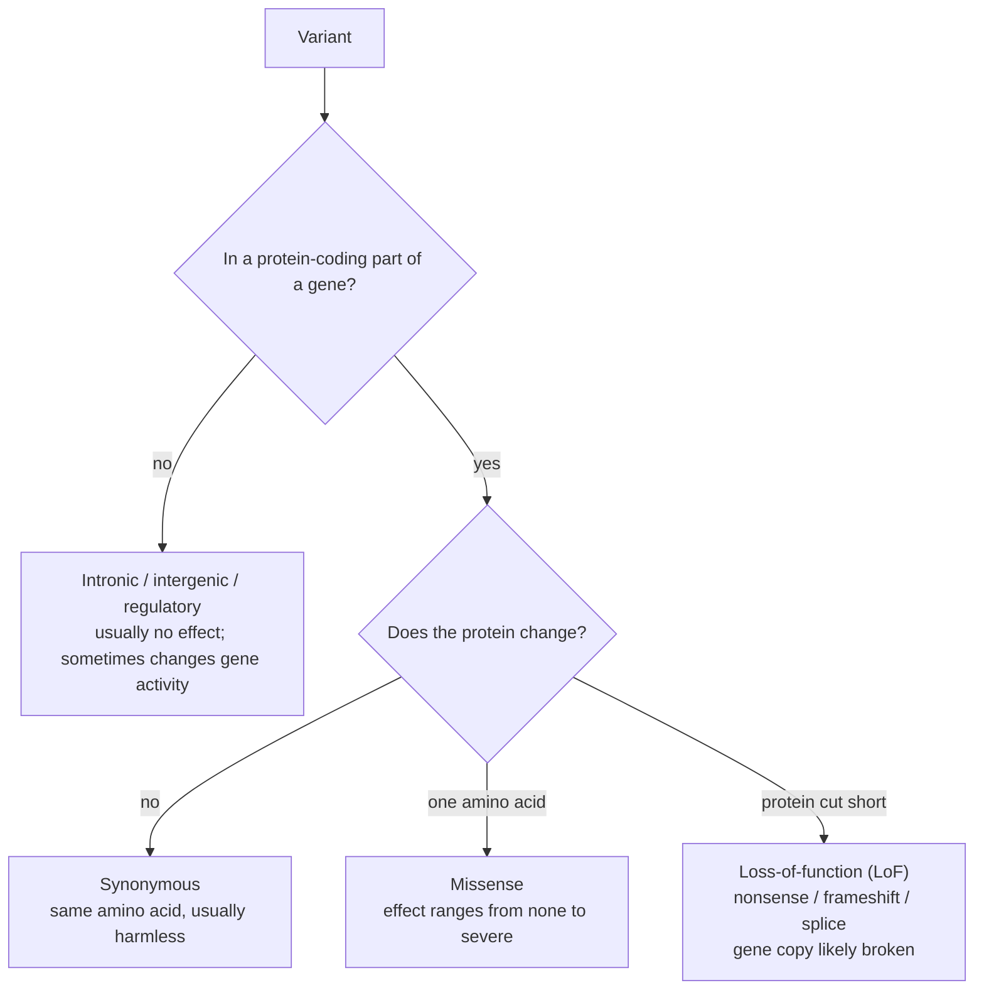
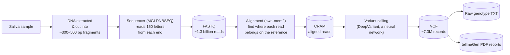

# A friendly introduction to your genome

This guide explains every concept and term used in this project's reports and dashboard, and what each of your data files holds. It assumes no biology background. Read it top to bottom once, then use the [glossary](#glossary) as a reference. The dashboard's tooltips link back here.

**Contents**

1. [DNA, genes and chromosomes](#1-dna-genes-and-chromosomes)
2. [The reference genome: a shared map](#2-the-reference-genome-a-shared-map)
3. [Variants: how your genome differs](#3-variants-how-your-genome-differs)
4. [Two copies: zygosity, sex chromosomes and mitochondria](#4-two-copies-zygosity-sex-chromosomes-and-mitochondria)
5. [How whole-genome sequencing works](#5-how-whole-genome-sequencing-works)
6. [Your files, one by one](#6-your-files-one-by-one)
7. [What this project creates](#7-what-this-project-creates)
8. [Reading the QC report](#8-reading-the-qc-report)
9. [From variant to meaning: interpretation](#9-from-variant-to-meaning-interpretation)
10. [What sequencing cannot tell you](#10-what-sequencing-cannot-tell-you)
11. [Glossary](#glossary)

---

## 1. DNA, genes and chromosomes



- **DNA** is a long molecule that stores instructions as a sequence of four chemical "letters", called **bases**: **A** (adenine), **C** (cytosine), **G** (guanine) and **T** (thymine).
- DNA has two strands twisted into a **double helix**. The strands are complementary: A always pairs with T, and C with G. So if you know one strand, you know the other. One letter plus its partner is a **base pair (bp)**.
- Your **genome** is the complete set of DNA in a cell: about **3.1 billion** base pairs per copy. You have two copies, one from each parent.
- The genome is split into **chromosomes**: 22 numbered pairs (**autosomes**, chr1 to chr22, roughly largest to smallest) plus the **sex chromosomes** (XX or XY). There is also a tiny separate circle of DNA in the **mitochondria**.
- A **gene** is a stretch of DNA that encodes a product, usually a protein. Humans have about 20,000 protein-coding genes. Gene names are short codes such as *BRCA1*, *CYP2D6* or *APOE*.
- Only about 1–2% of the genome codes for protein. The rest includes switches that control when genes turn on (**regulatory regions**), structural DNA, and a lot whose function is still unknown.



This is the "central dogma" of biology. A change in DNA can change the protein and therefore its function. Usually it doesn't: most changes are harmless.

## 2. The reference genome: a shared map

To describe *your* DNA, scientists compare it to a standard **reference genome**: a representative human sequence assembled from a few anonymous donors. The reference is not "normal" or "healthy". It's simply the agreed map.

- Every position has an address of the form **chromosome:position**, e.g. `chr7:117,559,590`.
- The map has had several editions, called **builds**. tellmeGen used **GRCh37** (also known as **hg19** or **b37**, released 2009). The newer **GRCh38** (2013) moves many coordinates, so a position number only makes sense together with its build. This project keeps everything in GRCh37 and labels the build everywhere.
- The reference is stored in a **FASTA** file: the letters of every chromosome. Extra unplaced pieces of sequence are called **contigs** (e.g. `GL000192.1`).
- **PAR (pseudoautosomal regions):** the tips of X and Y are nearly identical. tellmeGen's reference **masks** (replaces with `N`) the Y copy, so reads from those tips all map to X. That is why the reference filename ends in `par_y_masked`.

## 3. Variants: how your genome differs

Any two people are about **99.9%** identical. A typical genome still differs from the reference at about **4–5 million** positions. Each difference is a **variant**.

```
Reference:  ...G A T T A C A G A T T A C A...
You:        ...G A T T G C A G A T - - C A...
                       ↑           ↑↑
                      SNV        deletion (indel)
```

| Type | What it is | Example (REF → ALT) |
|---|---|---|
| **SNV** (single-nucleotide variant; called a **SNP** when common) | One letter swapped | `A → G` |
| **Insertion** | Extra letters added | `A → ATTG` |
| **Deletion** | Letters missing | `ATT → A` |
| **Indel** | Insertion or deletion, usually under 50 bp | |
| **MNV** | Several neighbouring letters changed together | `AC → GT` |
| **Structural variant (SV)** | Large deletions, duplications or inversions (50 bp to millions) | Hard to detect with short reads |
| **CNV** (copy-number variant) | A chunk present in more or fewer copies than usual | e.g. *CYP2D6* duplication |

- **REF / ALT:** the reference letter(s) and your alternative letter(s).
- **rsID** (e.g. `rs429358`): a permanent catalogue number from **dbSNP** for a known variant. Positions change between builds, but rsIDs don't.
- **Multiallelic site:** more than one alternative exists in the population (e.g. A→G and A→T). If you carry two different ALTs you are "1/2". This project splits these into one row per ALT.
- **HGVS notation**, used in medical reports: `NM_000492.4:c.1521_1523del (p.Phe508del)` means "in this transcript, coding letters 1521–1523 are deleted, which removes phenylalanine number 508 from the protein". That is the most common cystic fibrosis variant.

**What a variant does depends on where it is:**



## 4. Two copies: zygosity, sex chromosomes and mitochondria

You have two copies of each autosome. At any position the two copies can carry the same or different letters:

| Genotype (VCF) | Name | Meaning |
|---|---|---|
| `0/0` | **Homozygous reference** | Both copies match the reference |
| `0/1` | **Heterozygous (het)** | One copy reference, one copy variant |
| `1/1` | **Homozygous alternate (hom-alt)** | Both copies carry the variant |
| `1/2` | Compound het (at one site) | Two different variants, one on each copy |
| `1` | **Hemizygous (hemi)** | Only one copy exists (X or Y outside the PARs in XY people) |
| `./.` | **No call** | Not enough evidence to decide |

- **Phasing** means knowing which variants sit on the same copy (the one from mum or the one from dad). Your VCF is **unphased** (`/` rather than `|`). This matters for recessive conditions: two different broken variants in the same gene are only a problem if they are on *different* copies.
- **Sex chromosomes:** XY people have one X and one Y, so most X variants appear homozygous or hemizygous. Few heterozygous X calls is how the pipeline infers **genetic sex**.
- **Mitochondrial DNA (mtDNA / chrM):** 16,569 bp, hundreds of copies per cell, inherited only from your mother. The reference version is called **rCRS**. Because there are so many copies, a variant can be present in only a fraction of them, which is called **heteroplasmy**.
- **Y chromosome:** passed father to son almost unchanged. Together, mtDNA and Y give **haplogroups**: deep maternal and paternal lineages.

## 5. How whole-genome sequencing works



- **Read:** one short piece of sequenced DNA (here 150 letters). **Paired-end** means both ends of each fragment are read (read 1 and read 2), which helps place it accurately.
- **Coverage / depth (30x):** on average, each position is covered by about 30 overlapping reads. More reads give more confidence:

```
Reference   G A T T A C A G A T T A C A G G C T
read 1      G A T T G C A G A T
read 2        A T T A C A G A T T
read 3          T T G C A G A T T A
read 4            T A C A G A T T A C
read 5              G C A G A T T A C A
read 6                  A G A T T A
                    ↑
   depth here = 5 reads (read 6 starts later); 3 show G and 2 show A  →  heterozygous A/G
```

- **Base quality (Phred score, Q):** the sequencer's confidence in each letter. Q20 means a 1-in-100 error chance, Q30 means 1 in 1,000, and Q40 means 1 in 10,000.
- **Mapping quality (MAPQ):** how sure the aligner is that a read belongs where it was placed. In repetitive DNA a read could fit in several places, so MAPQ is low.
- **Duplicates:** identical copies of the same fragment created during lab amplification. They are marked (`.md.cram`) so they aren't counted twice.
- **Variant caller:** software that looks at the stack of reads, called a **pileup**, and decides the genotype. DeepVariant turns the pileup into an image and classifies it with a neural network. It is among the most accurate callers.

## 6. Your files, one by one

These live in `Genomics/WGS/` and are never modified by this tool.

| Folder / file | Format | Size | What it holds | Analogy |
|---|---|---|---|---|
| `05_FASTQ/*_1.fq.gz`, `*_2.fq.gz` | FASTQ, gzip | ~105 GB | Every raw read the sequencer produced: its letters and a quality score for each letter. Read 1 and read 2 of each pair are in matching order. Not yet placed on the map. | A box of a billion shredded book snippets |
| `04_CRAM/*.md.cram` | CRAM 3.0 | ~57 GB | The same reads, each placed at its position on GRCh37, sorted, with duplicates marked. Compressed by storing only differences from the reference, so the reference is needed to read it. | The snippets taped into the right page of a reference book |
| `04_CRAM/*.cram.crai` | CRAM index | 1.5 MB | A table of contents that lets tools jump straight to a region without reading the whole file | The book's index |
| `02_VCF/*.vcf.gz` | VCF 4.2, bgzip | ~150 MB | One line per position where DeepVariant looked closely: your genotype and the evidence for it. About 7.3M records: PASS (variant), RefCall (checked, matches reference) and NoCall (couldn't decide). | A list of every typo found, with confidence notes |
| `03_CSV/*.zip` → `.txt` | 23andMe-style TSV | 20 MB | Your genotype at ~757k positions on tellmeGen's standard panel: `rsid  chromosome  position  genotype`. Compatible with third-party tools. | A checklist of well-known spots |
| `03_CSV/*.vc.zip` → `.vc.txt` | same | 117 MB | The panel plus every other variant found (~4.6M rows) | Checklist plus all typos |
| `01_Reports/tellmegen/*_report.pdf` | PDF | ~60 KB each | tellmeGen's summary reports (ancestry, complex diseases, monogenic diseases, traits, wellness) | The provider's reading of your book |
| `01_Reports/tellmegen/*.zip` | zip of PDFs | 1–6 MB | The full sets: one PDF per condition or trait (100+ for complex diseases, 200+ for monogenic diseases) | Chapter-by-chapter notes |
| `MANIFEST.sha256` | text | <1 KB | SHA-256 fingerprints of the data files, to prove copies are bit-for-bit intact | A tamper seal |
| `README.md` | text | | Notes about the delivery | |

**How they relate:** FASTQ (raw) → CRAM (placed) → VCF (differences) → TXT and PDFs (summaries). Each step throws information away. The CRAM is the most complete *usable* record: it lets this project measure coverage everywhere and re-examine any position. The FASTQ is the archival original, needed only to redo alignment from scratch, for example against GRCh38.

**VCF anatomy** (a made-up example line):

```
#CHROM  POS        ID         REF  ALT  QUAL  FILTER  INFO  FORMAT                SAMPLE
chr19   45411941   rs429358   T    C    52.1  PASS    .     GT:GQ:DP:AD:VAF:PL    0/1:49:31:15,16:0.516:52,0,61
```

| Field | Meaning in this example |
|---|---|
| `GT 0/1` | Heterozygous: one T, one C |
| `GQ 49` | **Genotype quality**: Phred-scaled confidence that the genotype is right (49 ≈ 99.999%) |
| `DP 31` | **Depth**: 31 reads covered this spot |
| `AD 15,16` | **Allelic depth**: 15 reads say T, 16 say C |
| `VAF 0.516` | **Variant allele fraction**: 16/31. About 0.5 is expected for het, about 1.0 for hom-alt |
| `PL` | Likelihoods of 0/0, 0/1 and 1/1 (lower = more likely) |
| `FILTER` | `PASS` = confident variant · `RefCall` = looked, matches reference · `NoCall` = undecided |

## 7. What this project creates

Results go to `Genomics/wgs-data/` so the data folder stays untouched.

| Path | What it is |
|---|---|
| `cache/reference/GRCh37.primary_assembly.par_y_masked.fa` (+ `.fai`) | The reference genome rebuilt from Ensembl and **verified** against your CRAM (see below). `.fai` is its index. |
| `work/<sample>/variants/variants.parquet` | Every VCF record in a fast columnar table (**Parquet**), one row per ALT allele. It powers instant queries. |
| `work/<sample>/genotypes/raw_genotypes.parquet` | The tellmeGen TXT genotypes, merged, with a flag for panel positions |
| `work/<sample>/qc/fastq_stats.json` | Read length, base quality and GC content from a sample of raw reads |
| `work/<sample>/qc/alignment_stats.*` | Mapping, duplicate and error rates (samtools stats) |
| `work/<sample>/coverage/*` | Depth across the genome and a **callable** map: where there was enough data to trust a "matches reference" answer |
| `work/<sample>/qc/qc.json` | The QC summary the dashboard shows |
| `work/<sample>/stamps/*.json` | Bookkeeping: what ran, when, and on which inputs, so repeat runs skip finished work |
| `work/<sample>/logs/*.log` | Command output and errors for troubleshooting |

**Why the reference had to be rebuilt.** A CRAM stores only the differences from the reference. For each block of reads it also stores an **MD5 checksum**: a 32-character fingerprint of the exact reference letters underneath. Change one letter and the fingerprint changes completely. tellmeGen didn't include their reference file, so this project downloaded the public Ensembl GRCh37 release, adjusted the names and the Y masking, then decoded reads across every chromosome. Every block's fingerprint matched, and changing one letter as a test made decoding fail. So the rebuilt file matches theirs wherever your reads lie.

## 8. Reading the QC report

**Quality control (QC)** checks whether the data can be trusted before anything is interpreted.

| Metric | What it measures | Typical healthy range for 30x WGS | Why it matters |
|---|---|---|---|
| **SNV count** | Single-letter variants (PASS) | 3.3–4.6 M | Far outside means contamination, wrong build or a broken pipeline |
| **Indel count** | Small insertions/deletions | 0.55–1.2 M | Same |
| **Ti/Tv ratio** | **Transitions** (A↔G, C↔T: chemically similar swaps) ÷ **transversions** (all other swaps) | 2.0–2.1 genome-wide | Biology favours transitions. Random errors produce Ti/Tv ≈ 0.5, so a low ratio signals noise. |
| **Het/hom ratio** | Heterozygous ÷ homozygous-alt variants | ~1.3–2.0 (varies with ancestry) | Very high suggests contamination; very low suggests related parents or data loss |
| **Het VAF median** | Typical read split at het sites | ≈ 0.50 | Off-centre suggests a mixed sample or reference bias |
| **Depth (mean/median)** | Reads per position | ~30–40 | Lower depth means more missed variants |
| **% genome ≥ 20x** | Fraction covered well enough to call confidently | ≥ 85–90% | The rest is less certain |
| **Duplicate rate** | Reads that are lab copies | < 15% | High means wasted sequencing |
| **Mapping rate** | Reads placed on the reference | ≥ 97% | Low suggests contamination or poor DNA |
| **Concordance** | Agreement between the VCF and tellmeGen's TXT genotypes | ≥ 99% | A sanity check that the files belong together |
| **Genetic sex** | Inferred from X heterozygosity and Y presence | XX or XY | Mismatch flags a sample mix-up |

Each metric shows **pass**, **warn** or **fail** against the expected range.

## 9. From variant to meaning: interpretation

Most of your ~4.6 million variants do nothing noticeable. The job is to find the few that do, and to be honest about how sure we are.

### Inheritance patterns

| Pattern | You need… | Example |
|---|---|---|
| **Autosomal dominant** | One altered copy | *BRCA1* (cancer risk), familial hypercholesterolemia |
| **Autosomal recessive** | Both copies altered | Cystic fibrosis, sickle cell |
| **X-linked** | One altered X in XY people; usually two in XX | Hemophilia, G6PD deficiency |
| **Mitochondrial** | Inherited through the mother | Some deafness or vision conditions |

**Carrier** = one altered copy of a recessive gene. Carriers are usually healthy, but if both parents carry the same gene, each child has a 1-in-4 chance of being affected:

| | Parent A gives **N** | Parent A gives **c** |
|---|---|---|
| **Parent B gives N** | N N: unaffected (25%) | N c: carrier (25%) |
| **Parent B gives c** | N c: carrier (25%) | **c c: affected (25%)** |

N = working copy, c = altered copy. Overall: 25% unaffected, 50% carriers, 25% affected.

### Monogenic vs polygenic

- **Monogenic** (Mendelian): one variant in one gene has a large effect. These are rare. Examples: cystic fibrosis, *BRCA1/2*.
- **Polygenic** (complex): thousands of variants each nudge risk slightly, and lifestyle and environment matter a lot. Examples: heart disease, type 2 diabetes, height.
- **Penetrance:** the chance that someone with the variant actually develops the condition. *Complete* is close to 100%; *reduced* might be 20–60%.
- **Expressivity:** how severe it is when it does show up.

### Polygenic scores and percentiles

A **polygenic score** (PGS, or PRS when it is about disease risk) is a recipe published by a research team: a list of variants, and for each one a weight. Your score is the sum of the weights for the alleles you carry. On its own the number means nothing. It only makes sense compared with other people, so the tool:

1. **Finds your genetic neighbours.** Your genome is placed on the same map (principal components) as the 2,500 people of the 1000 Genomes Project, and the reference group you sit closest to (European, African, East Asian, South Asian or admixed American) is picked.
2. **Scores everyone the same way** — you and every reference person — using only variants found in both.
3. **Reports your percentile** within that group: the 80th percentile means your score is higher than 80% of them. Scores differ between ancestry groups for technical reasons, so comparing with the wrong group would mislead.

How to read the result:

- **Most people sit between the 10th and 90th percentile.** That is the normal range, not "low" or "high" risk.
- **A score is a tendency, not a forecast.** The best disease scores raise or lower the odds by a factor of 1.5–3 at the extremes. Lifestyle, family history and chance usually matter as much.
- **Scores work best in the ancestry they were built in** — still mostly European.
- **Grades:** the evidence grade depends on whether *other* research groups have tested the score, and in how many people; it is capped at Moderate. Your call is graded on how many of the score's variants could be read in your data (below 75% the score is not computed).
- **Single-variant traits** (eye colour, milk digestion, alcohol flush) are different: one variant with a large, replicated effect. Their evidence grade comes from how many publications report the link.

### Classifying a single variant (ACMG/AMP)

Clinical labs use a five-level scale, built from many types of evidence (population frequency, predicted effect, family studies, lab experiments):

```
Benign  ─  Likely benign  ─  VUS (uncertain)  ─  Likely pathogenic  ─  Pathogenic
  (harmless)                (we don't know yet)                       (causes disease)
```

- **VUS (Variant of Uncertain Significance)** means *unknown*, not "probably bad". Most VUS are later reclassified as benign. This project never treats a VUS as a finding.
- **ClinVar** is the public database where labs submit classifications. Its **review stars** (0–4) show how well-supported a classification is: 0 = one submitter with no criteria; 2+ = several labs agree; 3–4 = expert panel or practice guideline.
- **ACMG SF (secondary findings) list:** 84 genes (v3.3) where a pathogenic variant is medically actionable (e.g. *BRCA1*, *LDLR*, *MYH7*). The Health page checks all of them first and shows how much of each gene was readable in your data.

### Variant effects: consequence and impact

The tool works out what each variant does to the gene it sits in. It uses Ensembl's gene map and `bcftools csq`, which also handles neighbouring variants that combine into one change. The **consequence** says what kind of change it is, and the **impact** groups consequences by how disruptive they are:

| Impact | Consequences | Meaning |
|---|---|---|
| **High** | stop gained, frameshift, splice donor/acceptor, start/stop lost | Probably breaks that copy of the protein (loss of function) |
| **Moderate** | missense, in-frame insertion/deletion | Changes the protein; the effect may be large or nothing |
| **Low** | synonymous, splice region | Unlikely to change the protein |
| **Modifier** | intron, UTR, non-coding gene, intergenic | Outside the protein code; usually no known effect |

Everyone has around 100 high-impact variants. Most are in genes that can tolerate losing one copy. **Impact is not the same as importance**: it describes the mechanism, not whether that matters for health.

### Population frequency

- **Allele frequency (AF):** how common a variant is in a population database. This project uses **1000 Genomes** (2,504 people from 26 populations, with a per-continent breakdown) and **gnomAD** (about 140,000 people). gnomAD's **popmax** is the highest frequency in any single population. Something carried by 5% of healthy people can't cause a rare severe disease, so frequency is one of the strongest filters.
- **Common** ≈ AF > 1%, **rare** < 1%, **ultra-rare/novel** = absent from gnomAD.

### Risk numbers: relative vs absolute

- **Odds ratio (OR)** / **relative risk:** "1.3× the risk" compares carriers with non-carriers.
- **Absolute risk:** the chance it actually happens to you. 1.3× a 1% lifetime risk is 1.3%, a small change. This project always shows the absolute number when it is known.
- **Polygenic risk score (PRS / PGS):** adds up many small effects into one score. It is reported as a **percentile**: "85th percentile" means higher than 85% of a reference population. PRS are most accurate for people whose ancestry matches the study population, which is mostly European today.

### Pharmacogenomics (PGx): genes and medicines

Most medicines are cleared or switched on by a small set of enzymes, mostly in the liver. Your versions of those genes decide how *fast* each enzyme works, and so how much of a drug ends up in your blood.

```
 dose ─▶ [ enzyme ] ─▶ cleared        slow enzyme  → drug builds up   → more side effects
                                     fast enzyme  → cleared quickly  → may not work
 pro-drug ─▶ [ enzyme ] ─▶ ACTIVE    slow enzyme  → little activated → may not work (codeine, clopidogrel)
```

- **Star alleles and diplotypes.** Each version of a pharmacogene is a named **star allele**: `*1` is usually the typical one; `*2`, `*4`… are specific combinations of variants defined by **PharmVar**. You have two copies, so your result is a pair, the **diplotype**, e.g. `*1/*4`.
- **Function and activity score.** Each allele has a function (normal, decreased, no function, increased). For some genes these add up to an **activity score**: normal + normal = 2; normal + none = 1.
- **Metaboliser phenotype.** The diplotype translates into **poor**, **intermediate**, **normal**, **rapid** or **ultrarapid** metaboliser. Transporters use "decreased / normal / increased function". These are normal human variation, not diseases. They only matter when you take a drug that depends on the enzyme.
- **Guidelines.** **CPIC** (US) and **DPWG** (Netherlands) are expert panels that publish what a prescriber should do for each phenotype: standard dose, a different dose, or a different drug. CPIC rates each recommendation *strong*, *moderate* or *optional*. **ClinPGx** (formerly PharmGKB) curates these guidelines and FDA label text.
- **Calling.** **PharmCAT** (the open tool clinical labs use) reads the variant file, works out diplotypes and matches them to every guideline. Three kinds of gene need help, given to PharmCAT as **outside calls**:
  - *CYP2D6* has a near-identical neighbour (the pseudogene *CYP2D7*) and is often deleted or duplicated, so it is called from the raw reads by **Cyrius**, which counts copies.
  - **HLA** genes (the immune system's "ID tags") have tens of thousands of versions; **T1K** types them from the reads. Certain HLA versions predict severe reactions to drugs like abacavir, allopurinol and carbamazepine.
  - *MT-RNR1* lives in mitochondrial DNA; rare variants cause hearing loss with aminoglycoside antibiotics.
- **Never change a medication based on this without your doctor.** A clinical PGx test confirms the result. Many hospitals now order one before prescribing clopidogrel or fluorouracil.

### Ancestry

- **Admixture / ancestry composition:** the estimated proportions of your genome that best match reference populations (e.g. 1000 Genomes regions). These are *statistical* estimates relative to modern samples, not a history of your family tree.
- **Haplogroup:** a branch on the mtDNA (maternal) or Y (paternal) family tree, e.g. `H1a` or `R1b-M269`. Each traces a single line back tens of thousands of years.

### How this project grades its confidence

Every claim in the dashboard carries two separate grades, and each grade lists the reasons behind it:

| Grade | Asks | Levels |
|---|---|---|
| **Evidence grade** | How good is the *science* linking this variant to an effect? | Strong · Moderate · Limited |
| **Call confidence** | How sure are we that *your genotype* is right? | High · Medium · Low · Not callable |

**The overall grade is the weaker of the two.** Strong science about a shaky call is not a strong finding.

How the evidence grade is set for a ClinVar-based claim (evidence model v2):

1. **Start from ClinVar review stars.** 3–4★ (expert panel / practice guideline) → Strong; 2★ (several labs agree) → Moderate; 0–1★ → Limited.
2. **Cap what ClinVar can't fully support.** Drug-response entries cap at Moderate until checked against CPIC/DPWG guidelines. "Conflicting" entries are always Limited.
3. **Check population frequency** for disease claims. If over 5% of any population carries the variant, it can't cause a rare severe disease, so the grade drops to Limited (the ACMG "BA1" rule). Over 1% lowers it one step ("BS1").
4. **Check the gene.** If ClinGen rates the gene–disease link *Disputed* or *Refuted*, the grade drops to Limited. If ClinGen rates it *Limited*, the grade drops one step.

Then three more questions turn "the variant is pathogenic" into "what it means for *you*":

5. **Which condition do the labs actually mean?** A ClinVar record merges every condition any lab named — some labs list every disease of the gene. The dashboard reads the individual lab submissions and keeps the conditions that labs name specifically; the rest are shown as "also listed". You can see every lab's verdict under **Who says so**.
6. **How is that condition inherited?** Inheritance comes from HPO and Orphanet (via the Mondo disease ontology), falling back to the gene. Combined with how many copies you carry, this sets **your role**: *carrier* (one copy, recessive), *both copies affected*, *may matter* (dominant: one copy can be enough, though often it isn't), or *unclear*. Carrier results go to the Carrier page.
7. **Is it medically actionable?** If the gene is on the ACMG SF list, the dashboard applies its reporting rule (e.g. recessive genes need two copies; *HFE* only counts two copies of C282Y) and shows ClinGen's actionability score.

**Computer predictions** fill the gap for rare variants no lab has classified. A variant is flagged only if it is rare (under 0.1% in every population), sits in a known disease gene, and either breaks the gene (in a gene that doesn't tolerate that, by LOEUF, or a recessive gene) or both AlphaMissense and REVEL call it damaging (or REVEL alone reaches the "strong" threshold). These are **always Limited**: prediction tools are useful hints, not verdicts.

**Risk factors** (common variants with small effects) get no role — the dashboard just tells you whether you carry one or two copies.

How call confidence is set: DeepVariant must call it PASS. Then a genotype quality (GQ) of at least 30 with at least 15 reads gives High, and a GQ of at least 20 with at least 10 reads gives Medium. A read balance far from what's expected lowers it one step; for one copy, the expected range is 20–80% of reads. Disagreement with the provider's genotype file makes it Low.

**Sensitive findings:** pathogenic results, and results in genes such as *BRCA1/2* or *APOE*, are hidden until you choose to reveal them.

### Keeping results current

Your DNA doesn't change, but knowledge about it does. ClinVar alone is updated weekly, and thousands of variants are **reclassified** every year (most often from "uncertain" to "benign"). So nothing here is a one-off snapshot:

1. **Knowledge sources are versioned.** `wgs knowledge refresh` checks each source (ClinVar, Ensembl genes, ClinGen, 1000 Genomes, gnomAD) for a newer version. It downloads only what changed and keeps the last few versions.
2. **Each pipeline run is a release** that records exactly which knowledge versions and grading rules it used.
3. **Each release stores a diff** against the release before it. The *What changed* tab shows sources that moved to a new version, findings added, removed or regraded, and every variant of yours whose ClinVar classification changed.

The joining happens on your own computer. Your variants are never sent to an online service.

### Accuracy benchmarking (Genome in a Bottle)

**GIAB** publishes reference people (e.g. **HG002**) whose genomes are known with very high accuracy. Running the same pipeline on HG002 and comparing gives:

- **Precision:** of the variants we called, the fraction that are real (few false alarms).
- **Recall / sensitivity:** of the real variants, the fraction we found (few misses).
- **F1:** a single score balancing the two.

## 10. What sequencing cannot tell you

- **Most traits are mostly not genetic, or involve thousands of genes.** Environment, lifestyle and chance matter a lot.
- **Short reads struggle in some places:** long repeats, segmental duplications, some disease genes with near-identical copies (*PMS2*, *SMN1*, *CYP2D6* partially), large structural variants and repeat expansions (e.g. Huntington's). The **callable** map tells you where data is thin.
- **A "negative" is not a guarantee.** Not finding a variant means no known pathogenic variant was found where we could look.
- **Knowledge changes.** Classifications are revised every month. That's why this project refreshes its evidence and shows what changed.
- **This is educational, not diagnostic.** Confirm anything important with a clinical-grade test and a genetic counsellor.

---

## Glossary

| Term | Meaning |
|---|---|
| **1000 Genomes** | Public reference panel of 2,504 people from 26 populations across 5 continents |
| **ACMG/AMP** | US professional bodies whose guidelines define the five-tier variant classification |
| **ACMG SF** | List of medically actionable genes reported as "secondary findings" |
| **Actionability** | Whether something can be done (screening, prevention, treatment) if you have a variant; ClinGen scores this per gene |
| **Activity score** | For some pharmacogenes, the sum of your two alleles' function values (normal = 1, decreased = 0.5 or 0.25, none = 0); 2 is typical |
| **AD** | Allelic depth: reads supporting each allele |
| **Admixture** | Estimated mix of ancestral populations |
| **AF / Allele frequency** | How common a variant is: the share of chromosomes in a population that carry it |
| **Alignment / mapping** | Placing reads at their position on the reference |
| **Allele** | One version of a sequence at a position (e.g. A or G) |
| **AlphaMissense** | Google DeepMind AI model scoring how likely a protein change (missense) is to be harmful, 0–1; above 0.564 is "likely pathogenic" |
| **ALT** | The non-reference allele |
| **Autosomal dominant (AD)** | One altered copy on chromosomes 1–22 can cause the condition; each child of a carrier has a 1-in-2 chance of inheriting it |
| **Autosomal recessive (AR)** | Both copies on chromosomes 1–22 must be altered; one copy makes you a healthy carrier |
| **Autosome** | Chromosomes 1–22 (not X/Y) |
| **b37 / GRCh37 / hg19** | The 2009 reference genome build used by your data |
| **BAM / CRAM** | Binary files of aligned reads; CRAM is smaller because it is reference-based |
| **Base / base pair (bp)** | One DNA letter / one letter plus its partner |
| **bgzip / tabix** | Block compression plus index that allow random access into big text files |
| **Build** | A version of the reference genome |
| **Callable** | A region with enough good-quality reads to trust a genotype, including "matches reference" |
| **Call confidence** | How sure we are that your genotype at a position is right (High / Medium / Low), from read depth, GQ and read balance |
| **Carrier** | Has one altered copy of a recessive gene |
| **chrM / mtDNA** | Mitochondrial genome |
| **ClinGen** | Expert consortium rating how strongly each gene is linked to each disease (Definitive → Refuted) |
| **ClinVar** | Public database of variant–disease classifications |
| **CNV** | Copy-number variant |
| **Compound heterozygous** | Two *different* altered variants in the same gene, one on each copy; for a recessive condition this can be like having two altered copies, but only if they are on different copies (not "in cis") |
| **Concordance** | Agreement between two sets of genotype calls |
| **Consequence** | What a variant does to a gene: missense, synonymous, frameshift, intron… |
| **Contig** | A continuous piece of the reference sequence |
| **Coverage / depth (DP)** | Number of reads over a position |
| **CPIC / DPWG** | Pharmacogenomic guideline groups (US / Netherlands) |
| **Cyrius** | Illumina's open tool that calls *CYP2D6* star alleles from reads by counting gene copies |
| **dbSNP / rsID** | Catalogue of known variants and their IDs |
| **DeepVariant** | Google's deep-learning variant caller, used by tellmeGen |
| **Digenic** | A condition that needs variants in two different genes together |
| **Diplotype** | Your pair of star alleles for a gene |
| **Duplicate reads** | PCR copies of the same DNA fragment |
| **Evidence grade** | How strong the science behind a claim is (Strong / Moderate / Limited), with the reasons listed |
| **Exon / intron** | Parts of a gene kept in / spliced out of the RNA |
| **FASTA** | Text format for sequences (used for the reference) |
| **FASTQ** | Text format for raw reads plus quality scores |
| **Frameshift** | An indel that shifts the 3-letter reading frame and usually breaks the protein |
| **Genotype (GT)** | Which versions you carry at a position, one per copy: `0/0`, `0/1`, `1/1`… (0 = reference, 1 = variant) |
| **GIAB / HG002** | Genome in a Bottle; a benchmark person with a "truth" genome |
| **gnomAD** | Large public database of population allele frequencies |
| **GQ** | Genotype quality (Phred-scaled) |
| **gVCF** | A VCF that also lists reference-matching blocks (yours is *not* a gVCF) |
| **Haplogroup** | Branch of the maternal (mtDNA) or paternal (Y) lineage tree |
| **Hemizygous** | Only one copy present (e.g. X in XY people) |
| **Heteroplasmy** | A mitochondrial variant present in only some mtDNA copies |
| **Heterozygous / homozygous** | Two different / two identical alleles |
| **HGVS** | Standard notation for describing variants (`c.` = coding DNA, `p.` = protein) |
| **HLA (human leukocyte antigen)** | Immune-system genes that label your cells as "self"; extremely variable, and some versions predict severe drug reactions |
| **Impact** | How disruptive a consequence is: High (likely breaks protein), Moderate, Low, Modifier (non-coding) |
| **Indel** | Small insertion or deletion |
| **Inheritance** | How a condition passes through families: dominant, recessive, X-linked, mitochondrial, etc. It decides what one copy of a variant means for you |
| **LOEUF** | gnomAD measure of how well a gene tolerates broken copies: low (under ~0.35) means healthy people almost never have one, so breaking it likely matters |
| **LoF** | Loss-of-function: variant expected to disable a gene copy |
| **Majority allele / reference-minor site** | A spot where the reference genome happens to carry the *rarer* version, so the "variant" listed is actually what most people have. Example: the GRCh37 reference carries Factor V Leiden (rs6025); most people, and a "two copies" result, have the normal version |
| **MAPQ** | Mapping quality |
| **MD5 / SHA-256** | File fingerprints (checksums) used to detect any change |
| **Metaboliser phenotype (metaboliser status)** | How quickly your version of an enzyme processes drugs: poor, intermediate, normal, rapid or ultrarapid |
| **Missense / nonsense / synonymous** | Changes one amino acid / creates a stop / no amino-acid change |
| **Mitochondrial inheritance (MT)** | Passed down only from the mother, through the mitochondria's own small genome |
| **MNV** | Multi-nucleotide variant |
| **Mondo** | Disease ontology that unifies disease names and IDs from OMIM, Orphanet and others |
| **Monogenic / polygenic** | Caused by one gene / by many genes together |
| **Multiallelic** | A site with more than one ALT allele |
| **Multifactorial** | Caused by many genes plus environment together, rather than one gene |
| **N** | An unknown or masked base |
| **NMD** | Nonsense-mediated decay: the cell destroys messages with an early stop, so no faulty protein is made |
| **NoCall / RefCall / PASS** | DeepVariant filter labels: undecided / matches reference / confident variant |
| **Odds ratio (OR)** | Relative risk measure from case–control studies |
| **Outside call** | A genotype worked out by a specialist tool (Cyrius, T1K) and handed to PharmCAT instead of being read from the VCF |
| **Paired-end** | Both ends of each DNA fragment are sequenced |
| **PAR** | Pseudoautosomal region (shared tips of X and Y) |
| **Parquet** | An open columnar file format for fast analytics |
| **Penetrance / expressivity** | Chance a variant causes disease / how severe it is |
| **Percentile** | Your position relative to a reference population (50th = middle) |
| **PharmCAT / ClinPGx** | Pharmacogenomics calling tool / knowledge base |
| **PharmVar** | The official catalogue of pharmacogene star alleles and the variants that define them |
| **Phasing** | Knowing which variants are on the same chromosome copy |
| **Phred score (Q)** | Quality on a log scale: Q30 = 1 in 1,000 error |
| **Pileup** | The stack of reads over a position |
| **Popmax** | The highest allele frequency of a variant in any single gnomAD population |
| **Precision / recall / F1** | Benchmark accuracy measures |
| **Predicted (computer prediction)** | A variant flagged by AI/statistical tools but never classified by a lab; always graded Limited here |
| **Prodrug (pro-drug)** | A medicine that does nothing until an enzyme converts it into its active form (codeine → morphine, clopidogrel) |
| **PRS / PGS (Polygenic risk score)** | A score adding up the small effects of many variants into one number, usually shown as a percentile |
| **Pseudogene** | A broken, near-identical copy of a gene (e.g. *CYP2D7* next to *CYP2D6*) that confuses short-read sequencing |
| **rCRS** | Reference mitochondrial sequence |
| **Read** | One sequenced DNA fragment (150 letters here) |
| **Reclassification** | A lab or expert panel changing a variant's ClinVar classification as evidence accumulates |
| **Reference genome** | The standard map that genomes are compared to |
| **REF** | The reference allele |
| **REVEL** | A score (0–1) combining 13 prediction tools for missense variants; ClinGen thresholds: 0.644 supporting, 0.773 moderate, 0.932 strong evidence of harm |
| **Review stars** | ClinVar's 0–4★ measure of how well-supported a classification is |
| **Secondary findings** | Medically actionable results looked for deliberately, beyond the reason a genome was sequenced (see ACMG SF) |
| **Semi-dominant (SD)** | One copy causes a milder form, two copies a more severe form |
| **SNP / SNV** | Single-letter variant (SNP usually means a common one) |
| **Splice site** | The boundary of an exon, where RNA is cut and joined; variants here can scramble the protein |
| **Sporadic** | Usually occurs without being inherited (a new change in that person) |
| **Star allele (`*`)** | Named haplotype of a pharmacogene |
| **Structural variant (SV)** | Large rearrangement (≥ 50 bp) |
| **T1K** | Open tool that types HLA (and other highly variable) genes from sequencing reads |
| **Ti/Tv** | Transition-to-transversion ratio (QC metric) |
| **Transition / transversion** | A↔G or C↔T / all other single-letter swaps |
| **UTR** | Untranslated region: the start (5′) and end (3′) of a gene's message that isn't turned into protein |
| **VAF** | Variant allele fraction: share of reads showing the variant |
| **Variant** | A position where your DNA differs from the reference genome — usually harmless, everyone has ~4–5 million |
| **VCF** | Variant Call Format: the standard variant file |
| **VUS** | Variant of uncertain significance |
| **WGS** | Whole-genome sequencing |
| **X-linked (XL / XLR / XLD)** | Gene on the X chromosome. Recessive (XLR): XY people are affected with one copy, XX people are usually carriers. Dominant (XLD): one copy can affect anyone |
| **Y-linked** | Gene on the Y chromosome, passed father to son |
| **Zygosity** | Whether you carry 0, 1 or 2 copies of an allele |
